# Diseño de interfaz de usuario

La aplicación tendrá la siguientes pantallas

1. Pantalla 1: Pantalla de carga

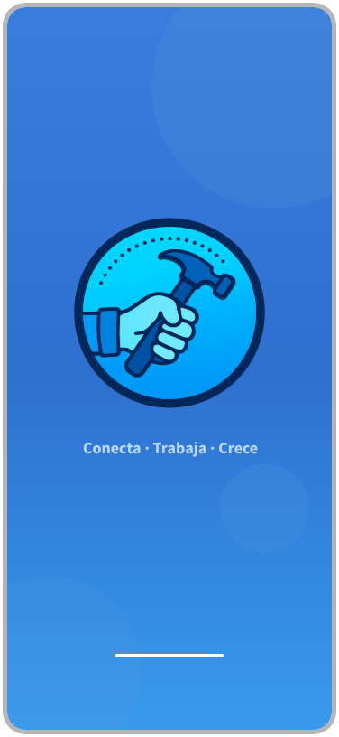

2. Pantalla 2: Home de la App
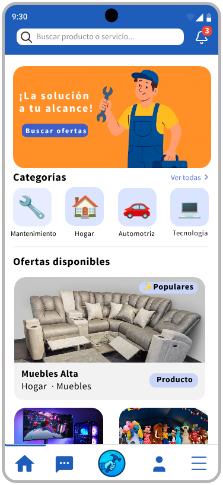

3. Pantalla 3: Página de tienda
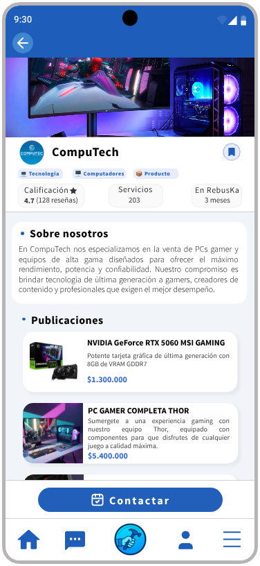

4. Pantalla 4: Login
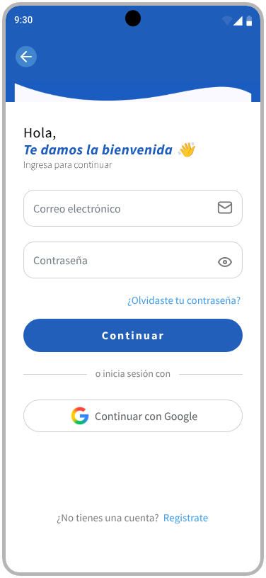

5. Pantalla 5: Registro Inicial (Roles)
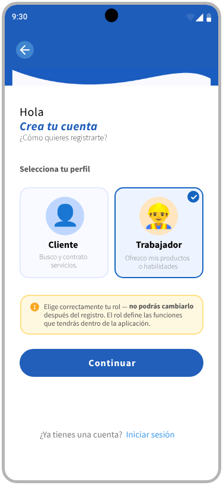

6. Pantalla 6: Registro 1
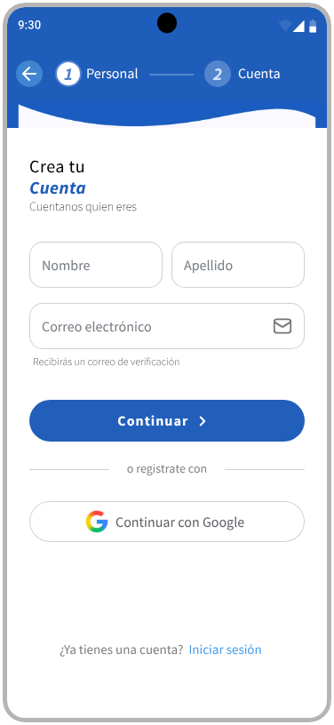

7. Pantalla 7: Registro 2
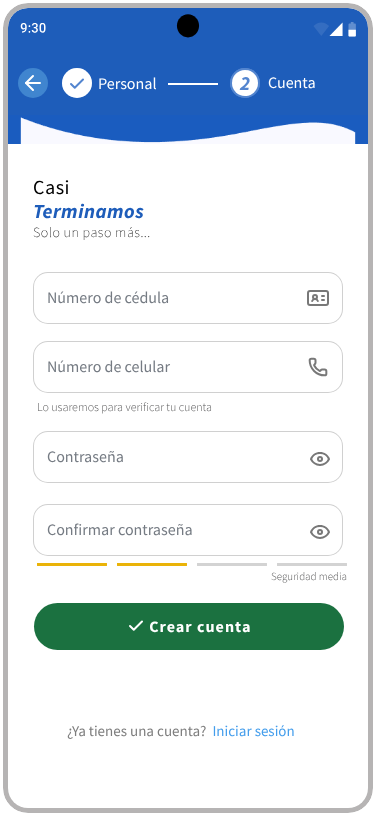

8. Pantalla 8: Verificación correo electrónico
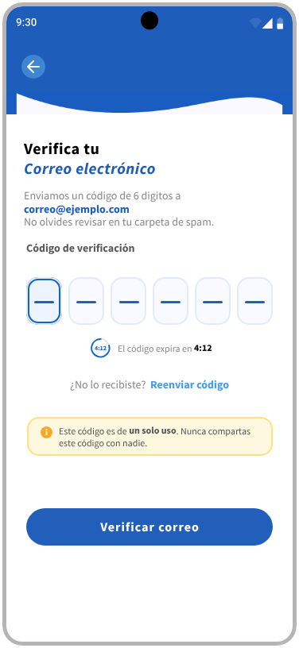

9. Pantalla 9: Verificación celular
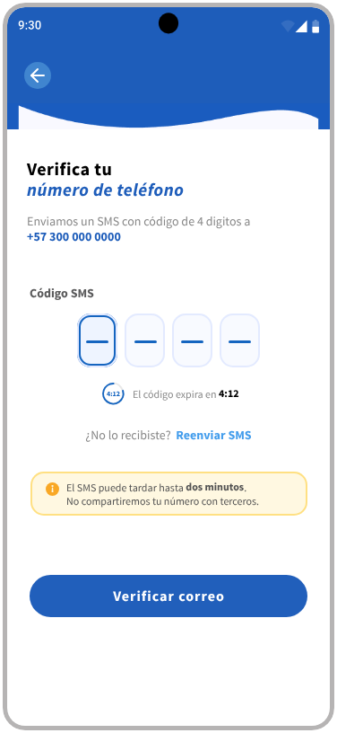

10. Pantalla 10: Perfil del trabajador
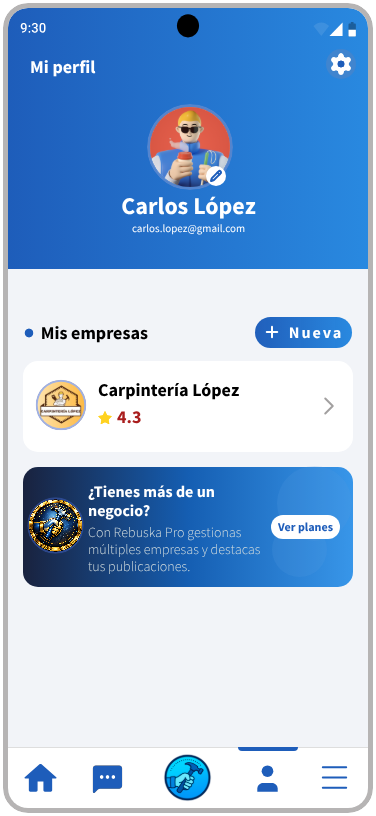

11. Pantalla 11: Panel de empresa
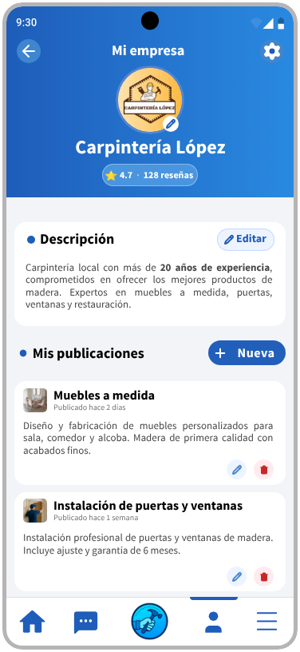

12. Pantalla 12: Listado de chats
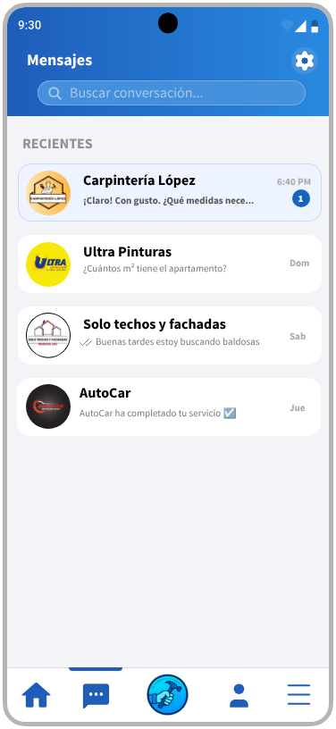

13. Pantalla 13: Chat individual
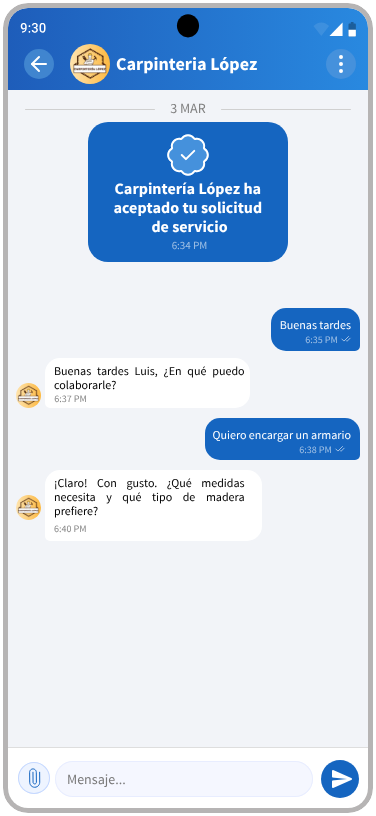

# Referencias

- [Material Design: Foundations](https://m3.material.io/foundations)
- [Material Design: Style](https://m3.material.io/styles)
